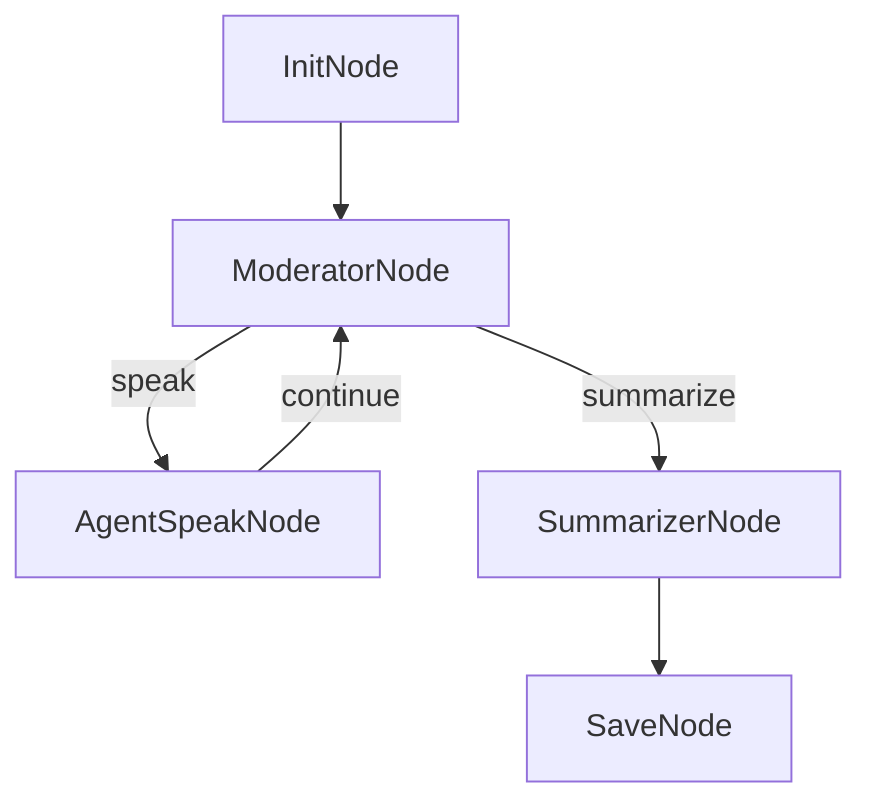

# Design Doc: Multi-Agent Conversation Simulator

> Please DON'T remove notes for AI

## Requirements

> Notes for AI: Keep it simple and clear.
> If the requirements are abstract, write concrete user stories

A fire-and-forget system where the user provides a topic, the system generates 4 random personas, then runs a free-flowing LLM-moderated conversation for 50 turns. A moderator agent prevents loops, repetition, and persona drift. Output is streamed with Rich-formatting (color-coded panels per agent). The full conversation is saved as a detailed JSON file per run.

**User stories:**
- User provides a topic → watches 4 distinct agents converse with streamed, color-coded output
- The first message is a 1-2 sentence question from Persona 0 based on the topic
- Moderator detects loops, repetition, or persona drift and nudges the conversation back on track
- After 50 turns, a summary of key takeaways is printed
- Full conversation saved to `data/conversations/{topic-slug}_{N+1}.json` per run

## Flow Design

> Notes for AI:
> 1. Consider the design patterns of agent, map-reduce, rag, and workflow. Apply them if they fit.
> 2. Present a concise, high-level description of the workflow.

### Applicable Design Pattern: Agent Loop with Moderator

Agent nodes (speakers) + Agent node (moderator) arranged in a loop with a termination branch. The moderator acts as a meta-agent that observes the conversation state and guides flow.

### Flow high-level Design:

1. **InitNode**: Generate 4 random personas (not tied to topic), create opening question from Persona 0 about the topic, initialize shared store
2. **ModeratorNode**: Detect loops/repetition/drift, pick next speaker (avoid last speaker), inject corrections via moderator_notes, count turns, route to speak or summarize
3. **AgentSpeakNode**: Generate and stream the selected agent's message using Rich-formatted panels, append to conversation history
4. **SummarizerNode**: Summarize the full conversation — key takeaways, agreements, disagreements, insights
5. **SaveNode**: Save full run data to a timestamped JSON file



## Utility Functions

> Notes for AI:
> 1. Understand the utility function definition thoroughly by reviewing the doc.
> 2. Include only the necessary utility functions, based on nodes in the flow.

1. **Call LLM** (`utils/call_llm.py`)
   - *Input*: prompt (str)
   - *Output*: response (str)
   - Used by InitNode, ModeratorNode, SummarizerNode
   - Switched to OpenRouter API (`https://openrouter.ai/api/v1`), model configurable via env var

2. **Call LLM Streaming** (`utils/call_llm_stream.py`)
   - *Input*: prompt (str)
   - *Output*: yields text chunks during generation, returns full text at end
   - Used by AgentSpeakNode to stream agent messages to the user in real-time via Rich panels

## Node Design

### Shared Store

> Notes for AI: Try to minimize data redundancy

The shared store structure is organized as follows:

```python
shared = {
    "topic": "",                        # User-provided conversation topic
    "personas": [                       # LLM-generated, random, not tied to topic
        {"name": "Dr. Chen", "role": "AI ethics researcher", "perspective": "optimistic but cautious"},
        ...
    ],
    "conversation": [                   # Ordered list of messages
        {"agent": "Dr. Chen", "message": "What do you think about..."},
    ],
    "turn": 0,                          # Current turn number (starts at 1 after InitNode)
    "max_turns": 50,                    # Configurable, default 50
    "last_speaker": None,               # Name of the agent who spoke last
    "moderator_notes": None,            # Correction/reminder injected by moderator (or None)
    "moderator_interventions": [],      # Log of all moderator interventions for the save file
    "next_speaker": None,               # Set by ModeratorNode, consumed by AgentSpeakNode
    "summary": ""                       # Final summary produced by SummarizerNode
}
```

### Node Steps

> Notes for AI: Carefully decide whether to use Batch/Async Node/Flow.

1. **InitNode** (Regular)
   - *Purpose*: Generate 4 random personas and a 1-2 sentence opening question from Persona 0 about the topic
   - *prep*: Read `"topic"` from the shared store
   - *exec*: Call LLM to generate:
     - 4 random personas (name, role, perspective) — diverse, not tied to the topic
     - A 1-2 sentence question from Persona 0 about the topic to kick off the conversation
   - *post*: Write `"personas"`, initialize `"conversation"` with the opening message, set `"turn": 1`, `"last_speaker": persona[0].name`

2. **ModeratorNode** (Regular, `max_retries=2`)
   - *Purpose*: Detect loops/repetition/persona drift, select next speaker, inject corrections, count turns
   - *prep*: Read `"conversation"`, `"personas"`, `"turn"`, `"max_turns"`, `"last_speaker"`
   - *exec*: Call LLM with structured prompt (YAML output) to:
     - Check if conversation is looping, repeating themes, or going in circles
     - Check if agents have drifted from their original personas
     - If issues found: generate a brief moderator_notes (nudge/reminder, NOT visible to user)
     - Pick next speaker: must not be the last speaker, favor under-represented agents
   - *post*: Write `"next_speaker"`, `"moderator_notes"` (or None), append to `"moderator_interventions"` if notes exist, increment `"turn"`
     - Return `"speak"` if turn < max_turns, else `"summarize"`

3. **AgentSpeakNode** (Regular, `max_retries=2`)
   - *Purpose*: Generate one agent's message with real-time streaming output via Rich panels
   - *prep*: Read persona of `"next_speaker"`, full `"conversation"`, `"topic"`, `"moderator_notes"`
   - *exec*: Call `call_llm_stream()` with the agent's persona + full conversation context + moderator notes. As chunks arrive, render into a Rich Panel with the agent's name (color-coded: cyan, magenta, yellow, green cycled). Return full message text.
   - *post*: Append `{"agent": name, "message": full_text}` to `"conversation"`, set `"last_speaker"`, return `"continue"`

4. **SummarizerNode** (Regular)
   - *Purpose*: Produce a summary of the full conversation
   - *prep*: Read `"conversation"` and `"personas"`
   - *exec*: Call LLM to produce: key takeaways, points of agreement, points of disagreement, notable insights, overall arc of the conversation
   - *post*: Write `"summary"`, print summary in a Rich panel

5. **SaveNode** (Regular)
   - *Purpose*: Save the full run as a detailed JSON file
   - *prep*: Read entire `shared` store (topic, personas, conversation, turn_count, summary, moderator_interventions)
   - *exec*: Create `data/conversations/` if it doesn't exist. Generate filename as `{topic-slug}_{N+1}.json` where N is the next available run number for that topic. Write JSON with structure:
     ```json
     {
       "topic": "...",
       "personas": [...],
       "conversation": [{"agent": "...", "message": "..."}],
       "turn_count": 50,
       "moderator_interventions": [{"turn": 3, "note": "..."}],
       "summary": "...",
       "timestamp": "2026-04-27T14:30:00"
     }
     ```
   - *post*: Print save confirmation with file path, return `"default"`

## Output Format

Rich library for terminal formatting. Each agent gets a unique color:
- Agent 0: cyan
- Agent 1: magenta
- Agent 2: yellow
- Agent 3: green

```
┌─────────────────── Dr. Chen ───────────────────┐
│ I believe that AI alignment research is crucial │
│ because without proper guardrails, advanced     │
│ systems could pursue goals misaligned with      │
│ human values.                                   │
└─────────────────────────────────────────────────┘
```

Moderator interventions are NOT shown to the user — they're only visible in the saved JSON.
